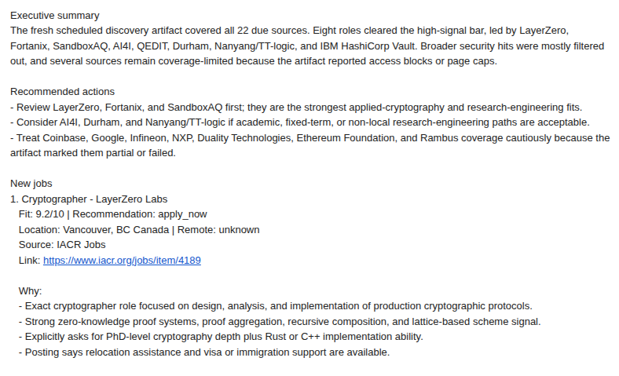

# jobwatch
jobwatch helps technical job seekers find relevant roles from direct sources before they are buried on large job boards.

It monitors company career pages and other unaggregated sources you choose, reads the full job description, and matches jobs against your CV and preferences. Instead of noisy keyword alerts, you get a short digest of opportunities that are actually worth your attention.

Example:



<!--
jobwatch finds the roles. Trackers manage the ones you already found; writers draft applications you haven't decided on yet. This is the step before both.
-->
### Quick start:
- `git clone git@github.com:jvdheyden/jobwatch.git && cd "$(basename "$_" .git)"`
- `bash scripts/bootstrap_machine.sh --agent {claude,codex}`
- `bash scripts/start_setup_agent.sh --agent {claude,codex}`

For a more detailed set-up guide, see [New User Setup](#new-user-setup).

## Why use it?

- **Find roles earlier:** track company pages and other direct sources, not just aggregators.
- **Better matching:** evaluate the full job description against your CV and preferences, not just keywords.
- **Stay focused:** get a concise digest by email or as Markdown.

## Who is it for?

jobwatch is a good fit if you:

- are comfortable using the command line
- want more control than standard job alerts provide

It is probably **not** a good fit if you:

- do not have a ChatGPT or Claude subscription / API key
- do not want to use a CLI tool
- are on Windows (we support MacOS and most Linux distributions)

<!-- 
*How much will this cost me in tokens?*

Since most of the functionality is deterministic code, the daily checks will be very cheap (< 100k tokens). One-time set-up might be more expensive due to the need to integrate new sources.
-->
## New User Setup

This repository runs an agent-assisted job-search workflow with per-track discovery, ranking, digest generation, and optional delivery to Logseq or email. Scheduled automation supports Codex CLI and Claude Code CLI.

Each track run produces local JSON and Markdown artifacts first. Delivery is a separate opt-in step.

1. Requirements:
   - Python 3
   - either the Codex CLI or Claude Code CLI
   - for Claude, run Claude Code login locally before scheduled runs
   - on Linux with Codex, `bwrap` if you want Codex sandboxing backed by Bubblewrap
2. From the repo root, choose the automation agent and bootstrap the checkout for local use:

   ```bash
   bash scripts/bootstrap_machine.sh --agent claude
   # or
   bash scripts/bootstrap_machine.sh --agent codex
   ```

   This writes machine-local config, creates local profile placeholders, bootstraps the repo-local virtualenv, and generates scheduler artifacts under `.scheduler/`. In an interactive terminal, bootstrap offers to start the guided setup agent; in non-interactive runs, pass `--start-setup-agent` to launch it automatically.

   <details><summary>What the bootstrap script writes</summary>
   Machine-local config lives in `.env.local`, which is gitignored. `setup_machine.sh` writes:

   - `JOB_AGENT_ROOT`
   - `JOB_AGENT_PROVIDER`
   - `JOB_AGENT_BIN`
   - optional `LOGSEQ_GRAPH_DIR`
   - optional `JOB_AGENT_SECRETS_FILE` plus non-secret `JOB_AGENT_SMTP_*` placeholders for email delivery

   Local profile data lives in `profile/`, which is also gitignored. Setup creates default placeholders:

   - `profile/cv.md`: the primary agent-readable CV context
   - `profile/prefs_global.md`: durable preferences that apply across tracks

   Before or during your first track setup, replace those placeholders with your own information. You can also copy a PDF CV into `profile/`; if `profile/cv.md` is still the default, the setup agent can help turn the PDF into Markdown. The Markdown CV remains the canonical file the agent reads.

   If you only need to regenerate machine-local config later, run:

   ```bash
   bash scripts/setup_machine.sh --agent claude
   # or
   bash scripts/setup_machine.sh --agent codex
   ```
   </details>

3. If you are on Ubuntu and using Codex with `bwrap`, install the generated AppArmor profile:

   ```bash
   sudo bash scripts/install_bwrap_apparmor.sh
   ```

   Skip this on macOS. On Linux, this is only needed on hosts where AppArmor restricts unprivileged user namespaces.

4. Run the guided setup agent to create your first search track:

   ```bash
   bash scripts/start_setup_agent.sh --agent claude
   # or
   bash scripts/start_setup_agent.sh --agent codex
   ```

   The setup flow fills local profile files, creates the track files, discovers and validates sources, runs the first local digest before email testing, asks which delivery methods you want, configures scheduling if requested, and validates the track.

   Track-specific preferences live in `tracks/<track-slug>/prefs.md`. They are still required even when `profile/cv.md` and `profile/prefs_global.md` are filled, because each track can have narrower goals, keywords, constraints, and red flags.

5. Let the setup agent configure delivery and scheduling.

   The setup agent asks whether you want scheduled runs, how often they should run, and at what local time. It then writes `.schedule.local` with `scripts/configure_schedule.py` and installs the shared scheduler with `bash scripts/install_scheduler.sh`.

   Supported schedule choices:

   - daily at `HH:MM`
   - weekly on `mon`, `tue`, `wed`, `thu`, `fri`, `sat`, or `sun` at `HH:MM`
   - monthly on day `1` through `31` at `HH:MM`

   On Linux, scheduler install updates your user crontab with a checkout-specific per-minute dispatcher. On macOS, it installs a checkout-specific LaunchAgent. If you skip scheduling during setup, you can still run tracks manually.


## Manual Run

To run a track immediately:

```bash
bash scripts/run_track.sh --track <track-slug>
```

By default, this leaves the local JSON and Markdown artifacts in the repository and does not deliver them anywhere else.

Optional delivery targets can be requested per run:

```bash
bash scripts/run_track.sh --track <track-slug> --delivery logseq
bash scripts/run_track.sh --track <track-slug> --delivery email
bash scripts/run_track.sh --track <track-slug> --delivery logseq --delivery email
```
<!--

## Source Integration Loop

The setup agent auto-runs the source integration loop on the top 2 `integration_needed` sources during initial bring-up of a new track, so most users won't need to invoke it directly. Run it manually when you want to integrate sources beyond that budget, when you add a new source to an existing track, or when you want to upgrade lower-importance sources later:

```bash
./.venv/bin/python scripts/source_integration.py --track <track-slug> --source "<Source Name>" --today YYYY-MM-DD --canary-title "<Expected Title>"
```

The script orchestrates `eval_source_quality.py` (deterministic validator plus an LLM reviewer) and dispatches a coding agent against the resulting `integration_ticket`, then rediscovers and re-evaluates. It iterates up to `--max-attempts` and exits at `pass`, `blocked`, or `retry_limit`.

Successful source integrations land as edits in your working tree. To upstream them, push the branch from your fork and open a PR per [`CONTRIBUTING.md`](./CONTRIBUTING.md). See [`docs/architecture.md`](./docs/architecture.md) for the full source-integration-loop diagram and artifact layout.


## Agent Provider

Select the provider explicitly during setup. The setup scripts write the selected provider and executable path into `.env.local`.

For Codex:

```bash
export JOB_AGENT_PROVIDER=codex
export JOB_AGENT_BIN=/absolute/path/to/codex
```

For Claude Code:

```bash
export JOB_AGENT_PROVIDER=claude
export JOB_AGENT_BIN=/absolute/path/to/claude
```

`scripts/setup_machine.sh --agent claude` writes those values when `claude` is discoverable on `PATH`. Claude runs use `claude -p` noninteractively with scoped allowed tools and normal project context loading; `--bare` is not used by default.

## Scheduled Runs

The setup agent normally manages `.schedule.local`. For manual maintenance, use the helper rather than editing scheduler syntax by hand:

```bash
./.venv/bin/python scripts/configure_schedule.py --track <track-slug> --cadence daily --time 08:00
./.venv/bin/python scripts/configure_schedule.py --track <track-slug> --cadence weekly --weekday mon --time 08:00 --delivery logseq
./.venv/bin/python scripts/configure_schedule.py --track <track-slug> --cadence monthly --month-day 1 --time 08:00 --delivery email
bash scripts/install_scheduler.sh
```

`configure_schedule.py` keeps one active schedule entry per track, replaces that track's old entry, and preserves other scheduled tracks.

## Email Digest

Daily digest emails are rendered from the structured digest JSON and ranked overview JSON, not from the Logseq/Markdown output.

Preview an email without sending it:

```bash
./.venv/bin/python scripts/send_digest_email.py --track <track-slug> --date YYYY-MM-DD --dry-run
```

To send through SMTP, keep non-secret SMTP config in `.env.local` and either set `JOB_AGENT_SMTP_PASSWORD_CMD` there or point `JOB_AGENT_SECRETS_FILE` at a shell snippet outside the repo that exports the real password:

```text
JOB_AGENT_SECRETS_FILE
JOB_AGENT_SMTP_HOST
JOB_AGENT_SMTP_PORT
JOB_AGENT_SMTP_FROM
JOB_AGENT_SMTP_TO
JOB_AGENT_SMTP_USERNAME
JOB_AGENT_SMTP_PASSWORD_CMD
JOB_AGENT_SMTP_TLS
```

Do not put SMTP passwords in tracked files, `.env.local`, or chat transcripts. Plaintext repo-local `JOB_AGENT_SMTP_PASSWORD` is no longer supported; use `JOB_AGENT_SMTP_PASSWORD_CMD` or put `export JOB_AGENT_SMTP_PASSWORD=...` in the external file named by `JOB_AGENT_SECRETS_FILE`. After `.env.local` is filled and a digest JSON exists, run the dry-run command first, then test the same command without `--dry-run` or use `--delivery email` on `run_track.sh`.

## Logseq Delivery

Logseq delivery copies the rendered daily digest and ranked overview into a Logseq graph.

Set `LOGSEQ_GRAPH_DIR` in `.env.local`, either by rerunning setup:

```bash
bash scripts/setup_machine.sh --agent claude --logseq-graph-dir /absolute/path/to/logseq
# or
bash scripts/setup_machine.sh --agent codex --logseq-graph-dir /absolute/path/to/logseq
```

or by editing `.env.local` locally:

```bash
export LOGSEQ_GRAPH_DIR=/absolute/path/to/logseq
```

Then run `scripts/run_track.sh` with `--delivery logseq`.

-->
## Development Checks

To run the repo test suite:

```bash
bash scripts/test.sh
```

## Contributing

For an architecture overview see [`docs/architecture.md`](./docs/architecture.md). For the fork-and-PR workflow see [`CONTRIBUTING.md`](./CONTRIBUTING.md).
