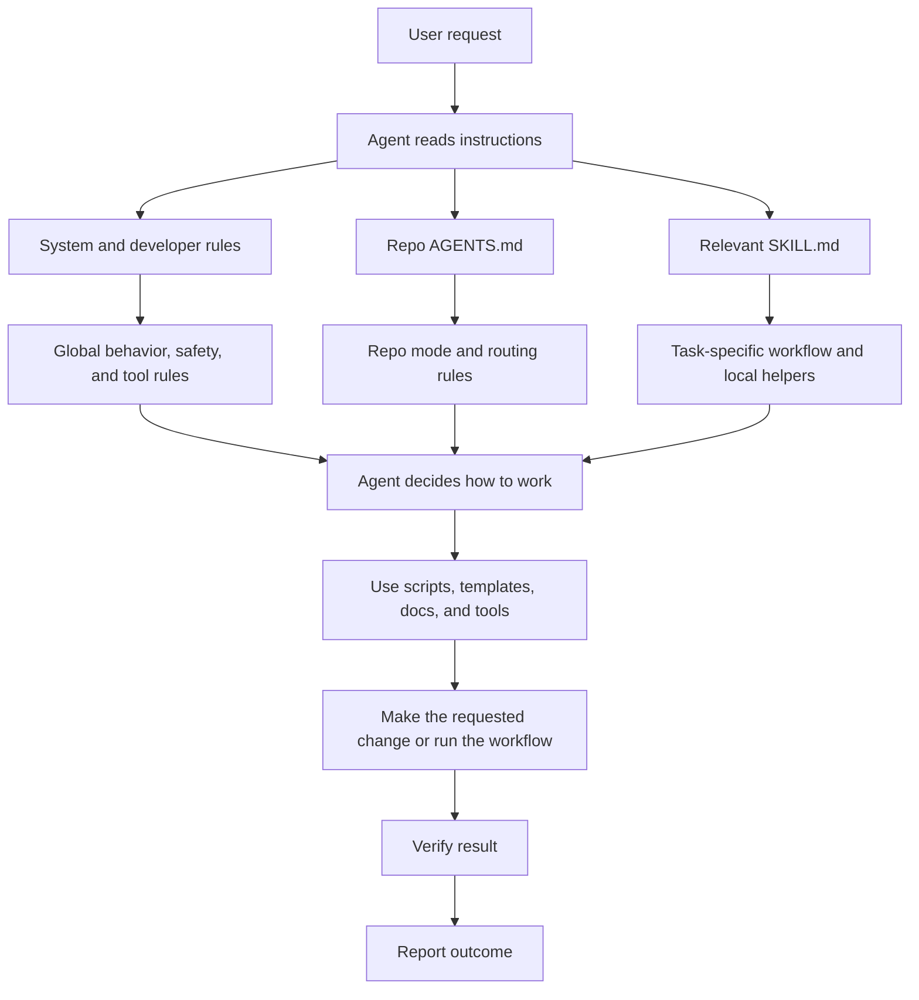

# Agent Instructions and Skills

```mermaid
flowchart TD
  A[User request] --> B[Agent reads instructions]

  B --> C[System and developer rules]
  B --> D[Repo AGENTS.md]
  B --> E[Relevant SKILL.md]

  C --> F[Global behavior, safety, and tool rules]
  D --> G[Repo mode and routing rules]
  E --> H[Task-specific workflow and local helpers]

  F --> I[Agent decides how to work]
  G --> I
  H --> I

  I --> J[Use scripts, templates, docs, and tools]
  J --> K[Make the requested change or run the workflow]
  K --> L[Verify result]
  L --> M[Report outcome]
```
