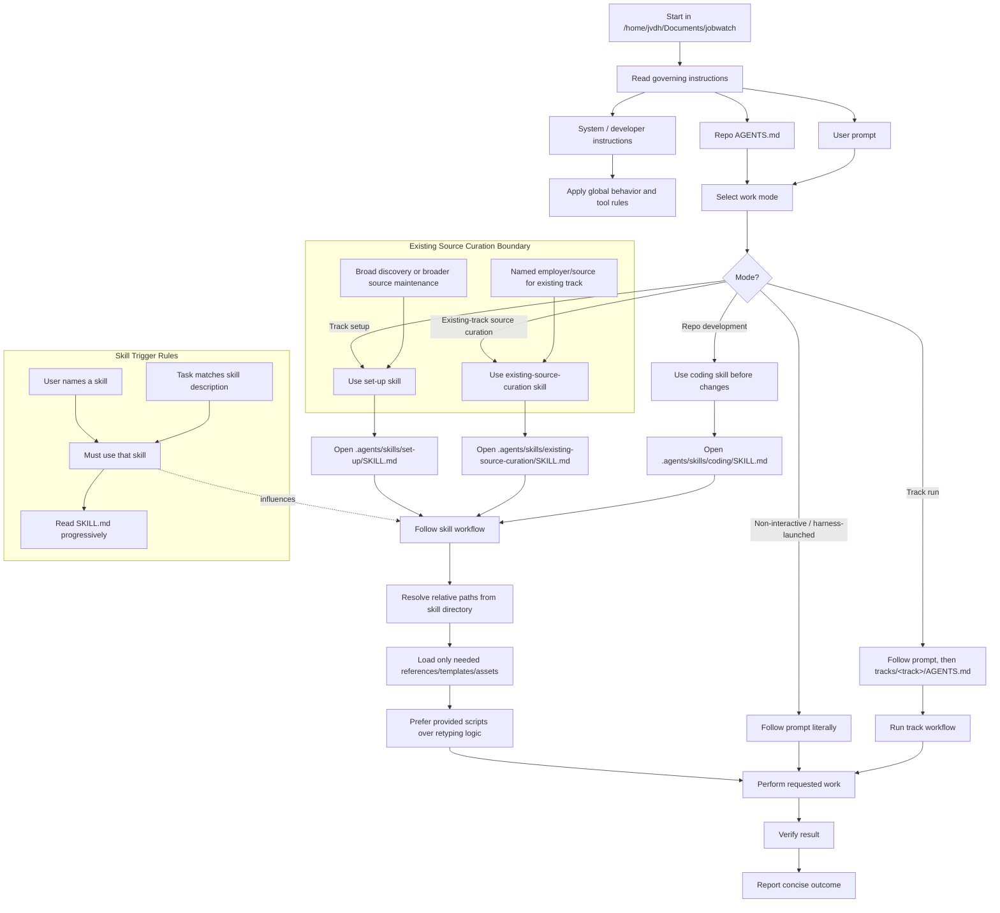

# Agent Instructions and Skills

```mermaid
flowchart TD
  A[Start in /home/jvdh/Documents/jobwatch] --> B[Read governing instructions]

  B --> C[System / developer instructions]
  B --> D[Repo AGENTS.md]
  B --> E[User prompt]

  C --> F[Apply global behavior and tool rules]
  D --> G[Select work mode]
  E --> G

  G --> H{Mode?}

  H -->|Non-interactive / harness-launched| I[Follow prompt literally]
  H -->|Track run| J[Follow prompt, then tracks/&lt;track&gt;/AGENTS.md]
  H -->|Track setup| K[Use set-up skill]
  H -->|Existing-track source curation| L[Use existing-source-curation skill]
  H -->|Repo development| M[Use coding skill before changes]

  J --> N[Run track workflow]
  K --> O[Open .agents/skills/set-up/SKILL.md]
  L --> P[Open .agents/skills/existing-source-curation/SKILL.md]
  M --> Q[Open .agents/skills/coding/SKILL.md]

  O --> R[Follow skill workflow]
  P --> R
  Q --> R

  R --> S[Resolve relative paths from skill directory]
  S --> T[Load only needed references/templates/assets]
  T --> U[Prefer provided scripts over retyping logic]
  U --> V[Perform requested work]

  I --> V
  N --> V

  V --> W[Verify result]
  W --> X[Report concise outcome]

  subgraph SkillTrigger[Skill Trigger Rules]
    Y[User names a skill] --> Z[Must use that skill]
    AA[Task matches skill description] --> Z
    Z --> AB[Read SKILL.md progressively]
  end

  Z -. influences .-> R

  subgraph SourceCurationRule[Existing Source Curation Boundary]
    AC[Named employer/source for existing track] --> L
    AD[Broad discovery or broader source maintenance] --> K
  end
```
