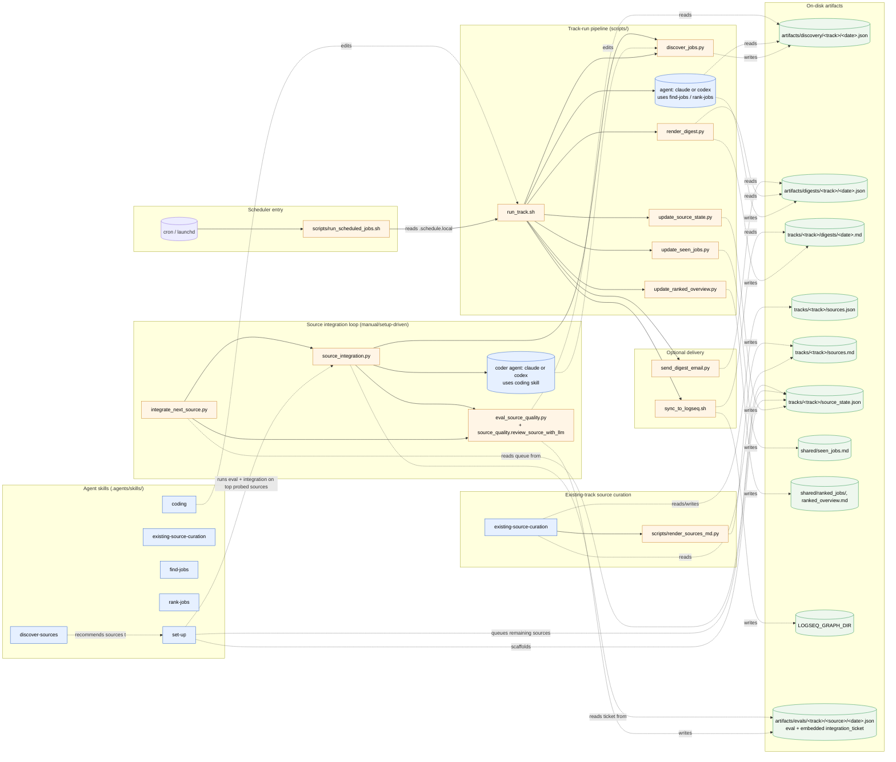
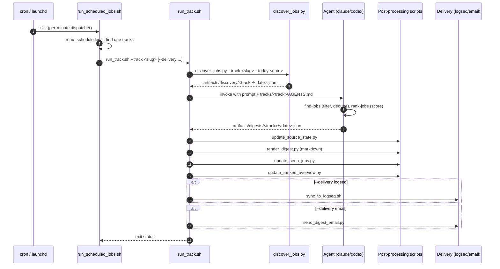
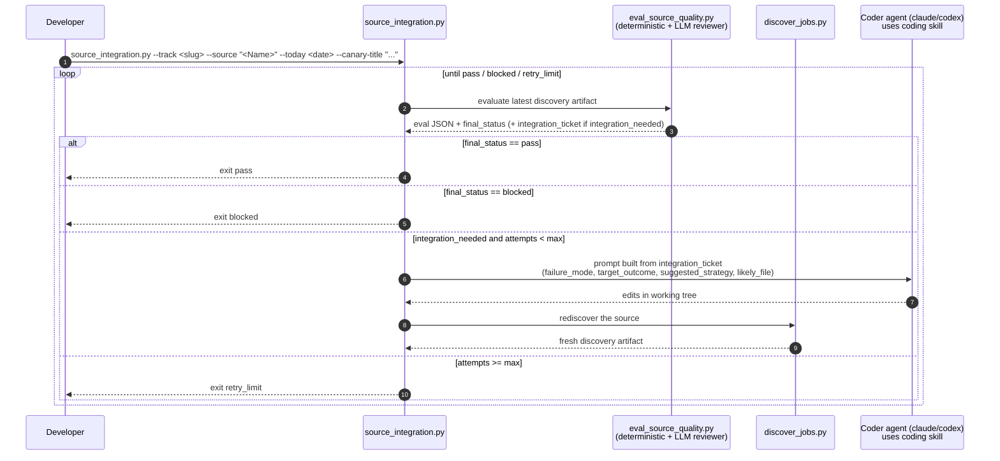

# Architecture Overview

This repo runs an agent-assisted job-search workflow. Each track combines deterministic Python helpers under `scripts/` with agent-driven skills under `.agents/skills/`. This page is the high-level map; per-source detail lives in the auto-generated [`discovery_modes.md`](./discovery_modes.md).

## Work modes

[`AGENTS.md`](../AGENTS.md) routes every prompt to one of four modes:

| Mode | Trigger | Lives in |
| --- | --- | --- |
| Track run | Scheduled or user prompt to run a track and produce a digest | `tracks/<track>/AGENTS.md`, agent skills, `scripts/` |
| Track setup | Prompt to create/scaffold a new search track | `set-up` skill |
| Existing-track source curation | Prompt to add/evaluate a single named employer or source for an existing track | `existing-source-curation` skill, `tracks/<track>/sources.json`, `scripts/render_sources_md.py` |
| Repo development | Prompt to change code, tests, skills, or docs | `coding` skill, `scripts/`, `tests/` |

## Component map

The flowchart shows how the agent skills, deterministic scripts, and on-disk artifacts interact across all four modes. Solid arrows are direct calls or invocations; dashed arrows are read/write of artifacts.

## Scheduled track run, end to end

The sequence diagram shows what happens for a single scheduled run.

## Source integration loop

New sources should be integrated in layers. First choose the best existing `discovery_mode`; then tune source-specific `search_terms` and native `filters` from the user's CV and preferences; then add provider filter support; only then add dedicated provider parsing or enumeration logic. The source integration loop in `scripts/source_integration.py` automates the coding-and-reevaluation part of that process for one source.

During track setup, the `set-up` skill probes newly added sources with canaries, tunes config first when results are noisy or too broad, dispatches `source_integration.py` for at most the top 2 sources that still need code, and writes the rest to `tracks/<track>/source_state.json` for one-per-day follow-up via `scripts/integrate_next_source.py`. Outside setup, run `integrate_next_source.py` manually to drain that queue. This loop is not triggered from scheduled track runs.

The reviewer role lives **inside each re-eval cycle**, not as a separate step between attempts. `scripts/eval_source_quality.py` runs a deterministic validator (`source_quality.validate_source_coverage`) and an LLM reviewer (`source_quality.review_source_with_llm`) over the discovery output; if defects remain, the eval emits an `integration_ticket` with a next action such as `config_terms_override`, `config_terms_append`, `config_native_filters`, `provider_filter_support`, or `dedicated_provider_logic`.

### Source integration artifacts

All source-integration-loop output lands under `artifacts/evals/<track>/<source_slug>/`:

- `<date>.json` — eval result with embedded `integration_ticket` (the canonical input to the next coder attempt)
- `<date>.source_integration_loop.json` — summary of the entire loop (phases, attempts, final status)
- `<date>.discovery.json` — fresh discovery artifact captured after a coder attempt
- `<date>.attempt<N>.coder.stdout.jsonl` / `.stderr.log` / `.last_message.txt` — per-attempt coder logs
- `<date>.attempt<N>.postmortem.json` — failure analysis written after a blocked attempt; fed back into the next attempt's prompt as prior context

When an integration lands a working fix, push the branch from your fork and open a PR per [`CONTRIBUTING.md`](../CONTRIBUTING.md) — the loop ends at the working-tree fix; upstreaming is the standard fork-and-PR flow.

## Where to read next

- [`AGENTS.md`](../AGENTS.md) — mode routing rules.
- [`README.md`](../README.md) — user-facing setup, manual runs, scheduling, delivery.
- [`docs/discovery_modes.md`](./discovery_modes.md) — auto-generated catalog of every supported provider.
- [`docs/contributing/adding-sources.md`](./contributing/adding-sources.md) — how to add a new discovery source.
- [`CONTRIBUTING.md`](../CONTRIBUTING.md) — fork-and-PR workflow for code or doc contributions.
- Per-skill instructions live under `.agents/skills/<skill>/SKILL.md` (canonical) and mirror to `.claude/skills/<skill>/SKILL.md` via `bash scripts/sync_claude_skills.sh`.
