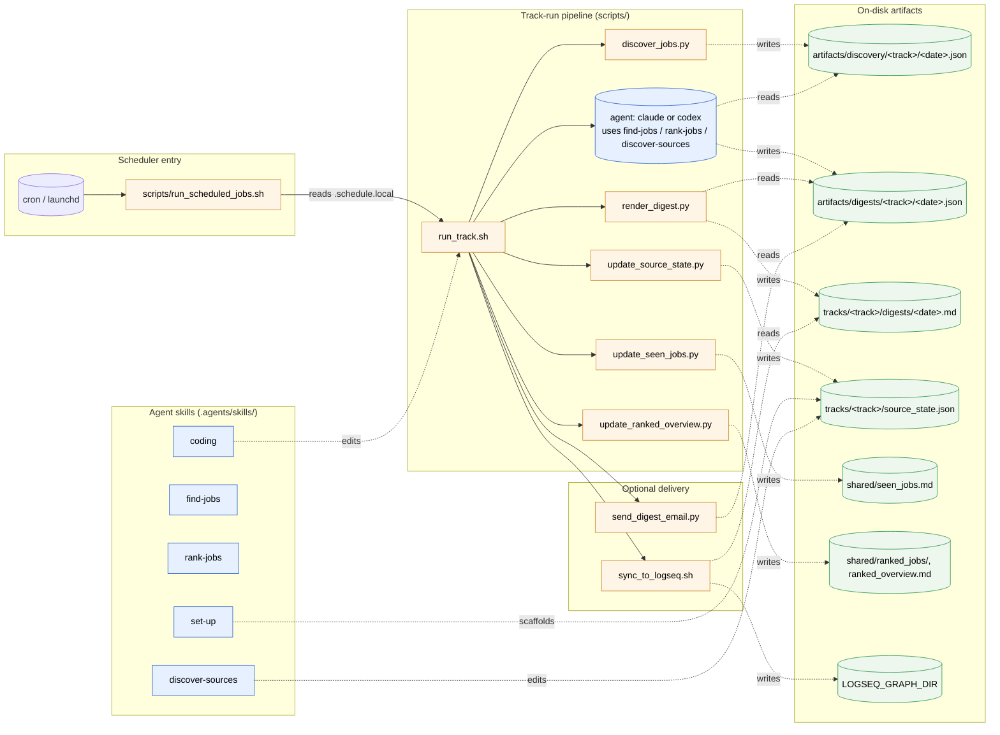
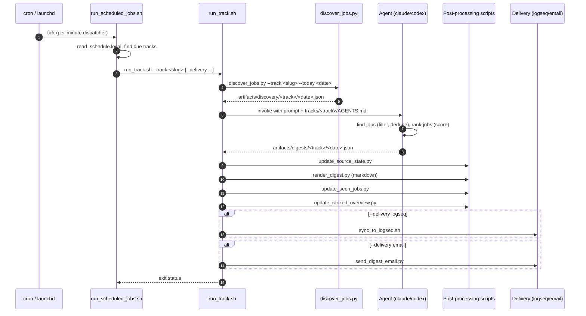

# Architecture Overview

This repo runs an agent-assisted job-search workflow. Each track combines deterministic Python helpers under `scripts/` with agent-driven skills under `.agents/skills/`. This page is the high-level map; per-source detail lives in the auto-generated [`discovery_modes.md`](./discovery_modes.md).

## Work modes

[`AGENTS.md`](../AGENTS.md) routes every prompt to one of four modes:

| Mode | Trigger | Lives in |
| --- | --- | --- |
| Track run | Scheduled or user prompt to run a track and produce a digest | `tracks/<track>/AGENTS.md`, agent skills, `scripts/` |
| Track setup | Prompt to create/scaffold a new search track | `set-up` skill |
| Existing-track source curation | Prompt to add/evaluate a single named employer or source for an existing track | `tracks/<track>/sources.json` + `scripts/render_sources_md.py` |
| Repo development | Prompt to change code, tests, skills, or docs | `coding` skill, `scripts/`, `tests/` |

## Component map

The flowchart shows how the agent skills, deterministic scripts, and on-disk artifacts interact across all four modes. Solid arrows are direct calls or invocations; dashed arrows are read/write of artifacts.

## Scheduled track run, end to end

The sequence diagram shows what happens for a single scheduled run.

## Where to read next

- [`AGENTS.md`](../AGENTS.md) — mode routing rules.
- [`README.md`](../README.md) — user-facing setup, manual runs, scheduling, delivery.
- [`docs/discovery_modes.md`](./discovery_modes.md) — auto-generated catalog of every supported provider.
- [`docs/contributing/adding-sources.md`](./contributing/adding-sources.md) — how to add a new discovery source.
- [`CONTRIBUTING.md`](../CONTRIBUTING.md) — fork-and-PR workflow for code or doc contributions.
- Per-skill instructions live under `.agents/skills/<skill>/SKILL.md` (canonical) and mirror to `.claude/skills/<skill>/SKILL.md` via `bash scripts/sync_claude_skills.sh`.
