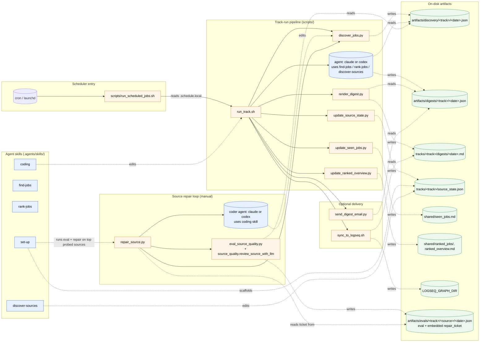
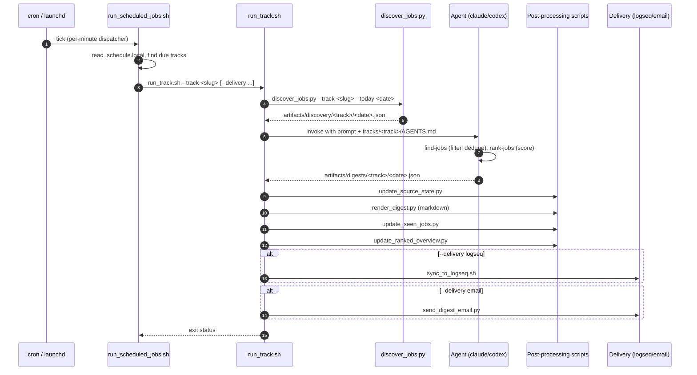
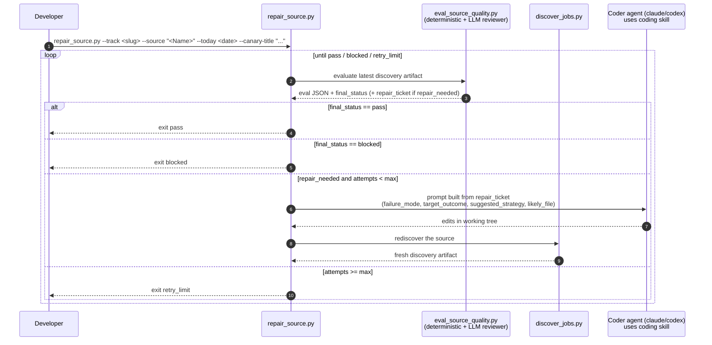

# Architecture Overview

This repo runs an agent-assisted job-search workflow. Each track combines deterministic Python helpers under `scripts/` with agent-driven skills under `.agents/skills/`. This page is the high-level map; per-source detail lives in the auto-generated [`discovery_modes.md`](./discovery_modes.md).

## Work modes

[`AGENTS.md`](../AGENTS.md) routes every prompt to one of four modes:

| Mode | Trigger | Lives in |
| --- | --- | --- |
| Track run | Scheduled or user prompt to run a track and produce a digest | `tracks/<track>/AGENTS.md`, agent skills, `scripts/` |
| Track setup | Prompt to create/scaffold a new search track | `set-up` skill |
| Existing-track source curation | Prompt to add/evaluate a single named employer or source for an existing track | `tracks/<track>/sources.json` + `scripts/render_sources_md.py` |
| Repo development | Prompt to change code, tests, skills, or docs | `coding` skill, `scripts/`, `tests/` |

## Component map

The flowchart shows how the agent skills, deterministic scripts, and on-disk artifacts interact across all four modes. Solid arrows are direct calls or invocations; dashed arrows are read/write of artifacts.

## Scheduled track run, end to end

The sequence diagram shows what happens for a single scheduled run.

## Source repair loop

Sources break: a job board changes its HTML, an ATS shifts an API field, a canary stops resolving. The repair loop in `scripts/repair_source.py` automates the inner cycle of detecting that a source is broken, dispatching a coding agent to fix it, and re-checking the result.

The loop is invoked two ways. During track setup, the `set-up` skill runs `eval_source_quality.py` on newly probed sources with canaries and auto-dispatches `repair_source.py` for the top 2 `repair_needed` sources by default (budget-capped — see `.agents/skills/set-up/SKILL.md` section 4c). Outside setup, run it manually per source for sources beyond that budget, sources added to an existing track later, or lower-importance sources you want to upgrade. It is not triggered from scheduled track runs.

The reviewer role lives **inside each re-eval cycle**, not as a separate step between fix attempts. `scripts/eval_source_quality.py` runs a deterministic validator (`source_quality.validate_source_coverage`) and an LLM reviewer (`source_quality.review_source_with_llm`) over the discovery output; if defects remain, the eval emits a `repair_ticket` and the next coder attempt fires.

### Repair artifacts

All repair-loop output lands under `artifacts/evals/<track>/<source_slug>/`:

- `<date>.json` — eval result with embedded `repair_ticket` (the canonical input to the next coder attempt)
- `<date>.repair_loop.json` — summary of the entire loop (phases, attempts, final status)
- `<date>.discovery.json` — fresh discovery artifact captured after a coder attempt
- `<date>.attempt<N>.coder.stdout.jsonl` / `.stderr.log` / `.last_message.txt` — per-attempt coder logs
- `<date>.attempt<N>.postmortem.json` — failure analysis written after a blocked attempt; fed back into the next attempt's prompt as prior context

When a repair lands a working fix, push the branch from your fork and open a PR per [`CONTRIBUTING.md`](../CONTRIBUTING.md) — the loop ends at the working-tree fix; upstreaming is the standard fork-and-PR flow.

## Where to read next

- [`AGENTS.md`](../AGENTS.md) — mode routing rules.
- [`README.md`](../README.md) — user-facing setup, manual runs, scheduling, delivery.
- [`docs/discovery_modes.md`](./discovery_modes.md) — auto-generated catalog of every supported provider.
- [`docs/contributing/adding-sources.md`](./contributing/adding-sources.md) — how to add a new discovery source.
- [`CONTRIBUTING.md`](../CONTRIBUTING.md) — fork-and-PR workflow for code or doc contributions.
- Per-skill instructions live under `.agents/skills/<skill>/SKILL.md` (canonical) and mirror to `.claude/skills/<skill>/SKILL.md` via `bash scripts/sync_claude_skills.sh`.
