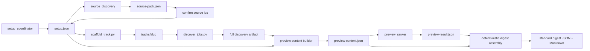
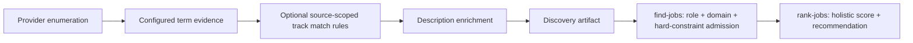
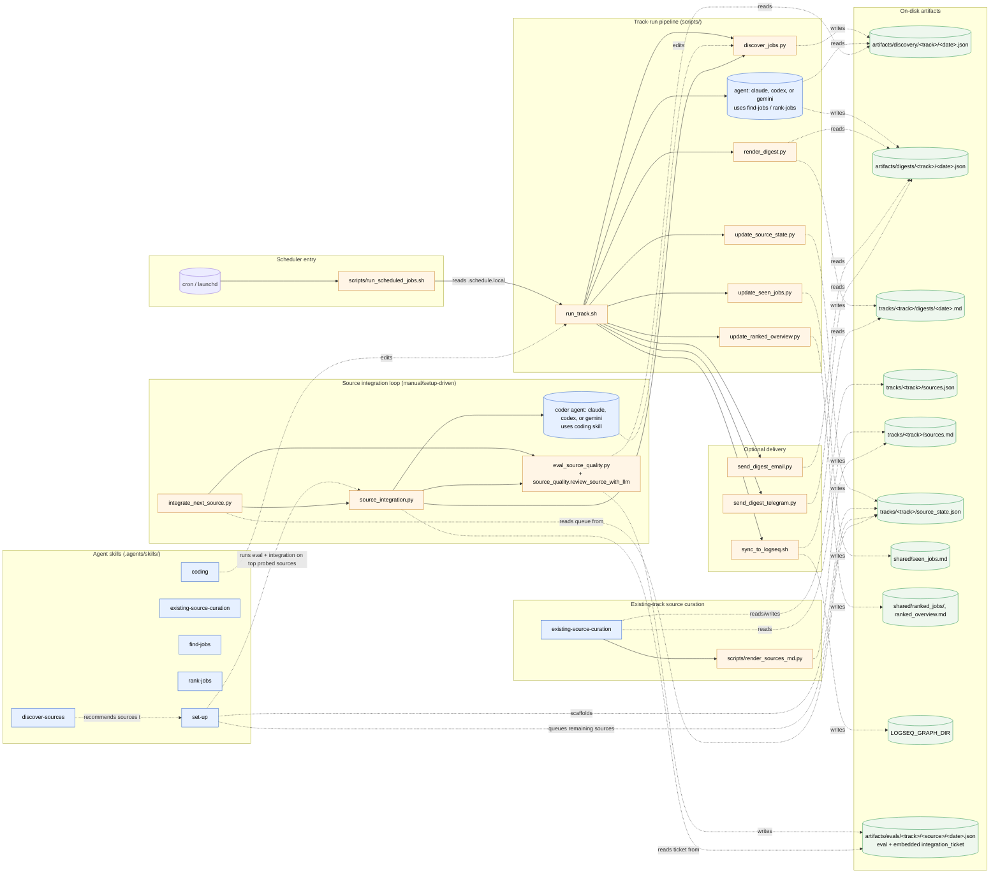
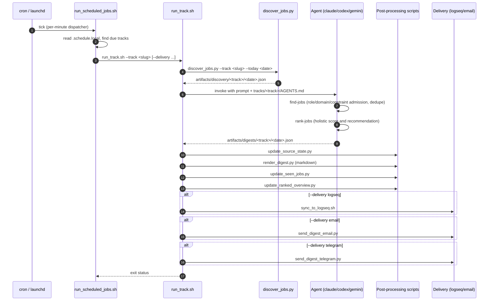
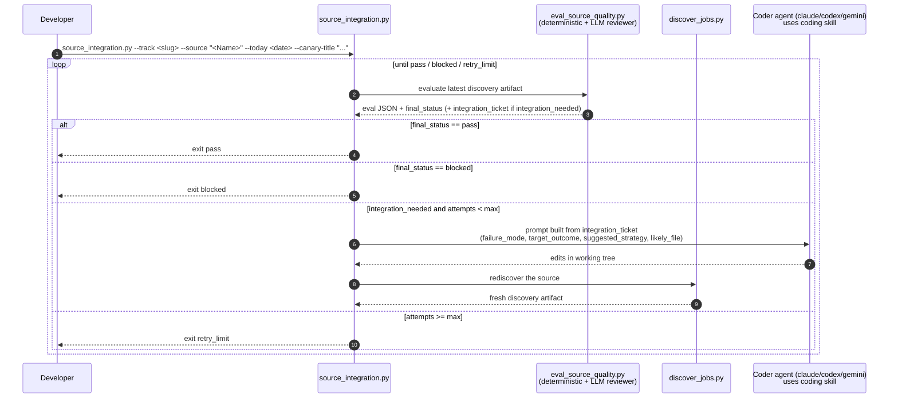

# Architecture Overview

This repo runs an agent-assisted job-search workflow. Each track combines deterministic Python helpers under `scripts/` with agent-driven skills under `.agents/skills/`. This page is the high-level map; per-source detail lives in the auto-generated [`shared/discovery_modes.md`](../shared/discovery_modes.md).

## Work modes

[`AGENTS.md`](../AGENTS.md) routes every prompt to one of four modes:

| Mode | Trigger | Lives in |
| --- | --- | --- |
| Track run | Scheduled or user prompt to run a track and produce a digest | `tracks/<track>/AGENTS.md`, agent skills, `scripts/` |
| Track setup | Prompt to create/scaffold a new search track | `set-up` skill |
| Existing-track source curation | Prompt to add/evaluate a single named employer or source for an existing track | `existing-source-curation` skill, `tracks/<track>/sources.json`, `scripts/render_sources_md.py` |
| Repo development | Prompt to change code, tests, skills, or docs | `coding` skill, `scripts/`, `tests/` |

## Guided setup boundary

Guided setup keeps one interactive coordinator but moves costly source discovery and first-preview ranking into two fresh bounded workers. The coordinator persists reviewed decisions under `artifacts/setup/<setup-id>/setup.json`; it does not pass its transcript to either worker.


```mermaid
flowchart LR
  Coordinator[setup_coordinator] --> Setup[setup.json]
  Setup --> SourceWorker[source_discovery]
  SourceWorker --> Pack[source-pack.json]
  Pack --> Confirm[confirm source ids]
  Confirm --> Setup
  Setup --> Scaffold[scaffold_track.py]
  Scaffold --> Track[tracks/slug]
  Track --> Discovery[discover_jobs.py]
  Discovery --> Full[full discovery artifact]
  Full --> Compact[preview-context builder]
  Setup --> Compact
  Compact --> Context[preview-context.json]
  Context --> Ranker[preview_ranker]
  Ranker --> Result[preview-result.json]
  Result --> Assemble[deterministic digest assembly]
  Context --> Assemble
  Assemble --> Digest[standard digest JSON + Markdown]
```

All setup artifacts use schema version 1 plus `kind` and `setup_id`, are size-capped, validated before consumption, and atomically written. `setup.json` is capped at 32 KiB and contains only a reviewed profile projection, track brief, source seeds, and confirmed canonical source configuration. `source-pack.json` is capped at 128 KiB and binds to the setup hash. `preview-context.json` is capped at 256 KiB, carries at most 40 unseen URL-deduplicated candidates, and limits each job description to 12 KiB. It deliberately excludes discovery `notes` as description evidence. `preview-result.json` is capped at 128 KiB, binds to the context hash, refers only to stable candidate ids, and must give every candidate exactly one disposition.

A minimal setup artifact has this synthetic shape:

```json
{
  "schema_version": 1,
  "kind": "jobwatch_setup",
  "setup_id": "20260720T155600Z-a1b2c3d4",
  "profile": {
    "user_name": "Example User",
    "seniority": ["senior"],
    "skills": ["Rust"],
    "experience_signals": ["production cryptography"],
    "positive_signals": ["hands-on ownership"],
    "borderline_signals": ["management-heavy roles"],
    "current_or_recent_employers": ["Previous Employer"]
  },
  "track": {
    "slug": "applied_crypto",
    "display_name": "Applied Cryptography",
    "search_area": "Applied cryptography and privacy engineering",
    "goals_or_role_types": ["Applied cryptography engineer"],
    "keep_only_keywords": ["cryptography"],
    "constraints_or_red_flags": ["No mandatory relocation"],
    "geography_or_remote_preferences": ["Europe", "remote"],
    "fit_language": "Hands-on cryptography roles compatible with reviewed location constraints."
  },
  "source_seeds": {
    "employers": [],
    "sectors_or_organizations": [],
    "career_pages_or_boards": []
  },
  "selected_sources": {
    "track_terms": [],
    "sources": [],
    "match_rules": []
  }
}
```

An empty selected source list is valid before confirmation but blocks `scaffold_track.py`. Source entries and match rules use the same canonical schemas as track `sources.json` and `match_rules.json`.

The deterministic assembler joins candidate judgments back to URLs and source coverage, then emits the existing digest schema. The two workers cannot write the workspace and never resume the coordinator conversation. Source discovery is web-capable; preview ranking is instructed and configured without routine web access. `scaffold_track.py` has no model role because it makes no model call.

Setup model defaults and provider command construction live in `scripts/agent_provider.py`. Explicit CLI arguments override provider/role environment values, which override tested defaults. These setup-only policies do not change `run_track.sh`, `source_reviewer`, or `source_coder` behavior.

## Candidate filtering boundary

Configured `sources.json` `track_terms` and source-specific `search_terms` are
retrieval vocabulary. Providers extract postings and compute generic term
evidence; ordinary candidate admission requires non-empty `matched_terms`, not
shared technical/non-technical role policy. Provider-native filters and narrow
source-protocol predicates remain part of enumeration.


```mermaid
flowchart LR
  Provider[Provider enumeration] --> Terms[Configured term evidence]
  Terms --> Rules[Optional source-scoped track match rules]
  Rules --> Enrich[Description enrichment]
  Enrich --> Artifact[Discovery artifact]
  Artifact --> Find[find-jobs: role + domain + hard-constraint admission]
  Find --> Rank[rank-jobs: holistic score + recommendation]
```

The existing optional `tracks/<track>/match_rules.json` hook runs before
fallback description enrichment and reports deterministic removals through
coverage limitations. Its source-scoped rules do not replace semantic track
preferences. `find-jobs` reads those preferences and decides candidate
admission by evaluating role-family fit, domain fit, and hard constraints as
separate questions. `rank-jobs` then re-evaluates the surviving candidates and
assigns `apply_now`, `watch`, or `skip`; it does not search for candidates that
were absent from the artifact.

First-preview selection remains capped at 40 unseen, URL-deduplicated
candidates. Candidates with more configured terms matched in their titles are
ordered first, followed by total matched-term count and stable discovery order.
This priority affects bounded selection only, not eligibility or semantic fit.

## Component map

The flowchart shows how the agent skills, deterministic scripts, and on-disk artifacts interact across all four modes. Solid arrows are direct calls or invocations; dashed arrows are read/write of artifacts.


```mermaid
flowchart LR
  classDef agent fill:#e6f0ff,stroke:#3366cc,color:#000
  classDef script fill:#fff5e6,stroke:#cc8833,color:#000
  classDef artifact fill:#eef7ee,stroke:#339955,color:#000

  subgraph Skills["Agent skills (.agents/skills/)"]
    SetUp[set-up]:::agent
    ExistingSourceCuration[existing-source-curation]:::agent
    FindJobs[find-jobs]:::agent
    RankJobs[rank-jobs]:::agent
    DiscoverSources[discover-sources]:::agent
    Coding[coding]:::agent
  end

  subgraph Scheduler["Scheduler entry"]
    Cron[(cron / launchd)]
    Sched[scripts/run_scheduled_jobs.sh]:::script
  end

  subgraph TrackRun["Track-run pipeline (scripts/)"]
    RunTrack[run_track.sh]:::script
    Discover[discover_jobs.py]:::script
    Agent[(agent: claude, codex, or gemini<br/>uses find-jobs / rank-jobs)]:::agent
    UpdState[update_source_state.py]:::script
    Render[render_digest.py]:::script
    Seen[update_seen_jobs.py]:::script
    Ranked[update_ranked_overview.py]:::script
  end

  subgraph SourceCuration["Existing-track source curation"]
    CurateSource[existing-source-curation]:::agent
    RenderSources[scripts/render_sources_md.py]:::script
  end

  subgraph Delivery["Optional delivery"]
    Logseq[sync_to_logseq.sh]:::script
    Email[send_digest_email.py]:::script
    Telegram[send_digest_telegram.py]:::script
  end

  subgraph SourceHealth["Source integration loop (manual/setup-driven)"]
    Integrate[source_integration.py]:::script
    IntegrateNext[integrate_next_source.py]:::script
    Eval[eval_source_quality.py<br/>+ source_quality.review_source_with_llm]:::script
    Coder[(coder agent: claude, codex, or gemini<br/>uses coding skill)]:::agent
  end

  subgraph Artifacts["On-disk artifacts"]
    DiscArt[(artifacts/discovery/&lt;track&gt;/&lt;date&gt;.json)]:::artifact
    StructDigest[(artifacts/digests/&lt;track&gt;/&lt;date&gt;.json)]:::artifact
    MdDigest[(tracks/&lt;track&gt;/digests/&lt;date&gt;.md)]:::artifact
    SrcConfig[(tracks/&lt;track&gt;/sources.json)]:::artifact
    SrcDoc[(tracks/&lt;track&gt;/sources.md)]:::artifact
    SrcState[(tracks/&lt;track&gt;/source_state.json)]:::artifact
    SeenJobs[(shared/seen_jobs.md)]:::artifact
    RankedOv[(shared/ranked_jobs/, ranked_overview.md)]:::artifact
    LogseqGraph[(LOGSEQ_GRAPH_DIR)]:::artifact
    EvalArt[(artifacts/evals/&lt;track&gt;/&lt;source&gt;/&lt;date&gt;.json<br/>eval + embedded integration_ticket)]:::artifact
  end

  Cron --> Sched
  Sched -->|reads .schedule.local| RunTrack
  RunTrack --> Discover
  Discover -.writes.-> DiscArt
  RunTrack --> Agent
  Agent -.reads.-> DiscArt
  Agent -.writes.-> StructDigest
  RunTrack --> UpdState
  UpdState -.writes.-> SrcState
  RunTrack --> Render
  Render -.reads.-> StructDigest
  Render -.writes.-> MdDigest
  RunTrack --> Seen
  Seen -.writes.-> SeenJobs
  RunTrack --> Ranked
  Ranked -.writes.-> RankedOv
  RunTrack --> Logseq
  Logseq -.reads.-> MdDigest
  Logseq -.writes.-> LogseqGraph
  RunTrack --> Email
  Email -.reads.-> StructDigest
  RunTrack --> Telegram
  Telegram -.reads.-> StructDigest

  SetUp -.scaffolds.-> SrcState
  SetUp -.runs eval + integration on top probed sources.-> Integrate
  SetUp -.queues remaining sources.-> SrcState
  DiscoverSources -.recommends sources to.-> SetUp
  CurateSource -.reads/writes.-> SrcConfig
  CurateSource -.reads.-> SrcDoc
  CurateSource --> RenderSources
  RenderSources -.writes.-> SrcDoc
  Coding -.edits.-> RunTrack

  IntegrateNext -.reads queue from.-> SrcState
  IntegrateNext --> Eval
  IntegrateNext --> Integrate
  Integrate --> Eval
  Eval -.reads.-> DiscArt
  Eval -.writes.-> EvalArt
  Integrate -.reads ticket from.-> EvalArt
  Integrate --> Coder
  Coder -.edits.-> Discover
  Integrate --> Discover
```

## Scheduled track run, end to end

The sequence diagram shows what happens for a single scheduled run.


```mermaid
sequenceDiagram
  autonumber
  participant Cron as cron / launchd
  participant Sched as run_scheduled_jobs.sh
  participant Track as run_track.sh
  participant Disc as discover_jobs.py
  participant Agent as Agent (claude/codex/gemini)
  participant Post as Post-processing scripts
  participant Deliv as Delivery (logseq/email)

  Cron->>Sched: tick (per-minute dispatcher)
  Sched->>Sched: read .schedule.local, find due tracks
  Sched->>Track: run_track.sh --track <slug> [--delivery ...]
  Track->>Disc: discover_jobs.py --track <slug> --today <date>
  Disc-->>Track: artifacts/discovery/<track>/<date>.json
  Track->>Agent: invoke with prompt + tracks/<track>/AGENTS.md
  Agent->>Agent: find-jobs (role/domain/constraint admission, dedupe)
  Agent->>Agent: rank-jobs (holistic score and recommendation)
  Agent-->>Track: artifacts/digests/<track>/<date>.json
  Track->>Post: update_source_state.py
  Track->>Post: render_digest.py (markdown)
  Track->>Post: update_seen_jobs.py
  Track->>Post: update_ranked_overview.py
  alt --delivery logseq
    Track->>Deliv: sync_to_logseq.sh
  end
  alt --delivery email
    Track->>Deliv: send_digest_email.py
  end
  alt --delivery telegram
    Track->>Deliv: send_digest_telegram.py
  end
  Track-->>Sched: exit status
```

## Source integration loop

New sources should be integrated in layers. First choose the best existing `discovery_mode`; then tune source-specific `search_terms` and native `filters` from the user's CV and preferences; then add provider filter support; only then add dedicated provider parsing or enumeration logic. The source integration loop in `scripts/source_integration.py` automates the coding-and-reevaluation part of that process for one source.

During track setup, the `set-up` skill probes newly added sources with canaries, tunes config first when results are noisy or too broad, dispatches `source_integration.py` for at most the top 2 sources that still need code, and writes the rest to `tracks/<track>/source_state.json` for one-per-day follow-up via `scripts/integrate_next_source.py`. Outside setup, run `integrate_next_source.py` manually to drain that queue. This loop is not triggered from scheduled track runs.

The reviewer role lives **inside each re-eval cycle**, not as a separate step between attempts. `scripts/eval_source_quality.py` runs a deterministic validator (`source_quality.validate_source_coverage`) and an LLM reviewer (`source_quality.review_source_with_llm`) over the discovery output; if defects remain, the eval emits an `integration_ticket` with a next action such as `config_terms_override`, `config_terms_append`, `config_native_filters`, `provider_filter_support`, or `dedicated_provider_logic`.


```mermaid
sequenceDiagram
  autonumber
  participant Dev as Developer
  participant Integrate as source_integration.py
  participant Eval as eval_source_quality.py<br/>(deterministic + LLM reviewer)
  participant Disc as discover_jobs.py
  participant Coder as Coder agent (claude/codex/gemini)<br/>uses coding skill

  Dev->>Integrate: source_integration.py --track <slug> --source "<Name>" --today <date> --canary-title "..."
  loop until pass / blocked / retry_limit
    Integrate->>Eval: evaluate latest discovery artifact
    Eval-->>Integrate: eval JSON + final_status (+ integration_ticket if integration_needed)
    alt final_status == pass
      Integrate-->>Dev: exit pass
    else final_status == blocked
      Integrate-->>Dev: exit blocked
    else integration_needed and attempts < max
      Integrate->>Coder: prompt built from integration_ticket<br/>(failure_mode, target_outcome, suggested_strategy, likely_file)
      Coder-->>Integrate: edits in working tree
      Integrate->>Disc: rediscover the source
      Disc-->>Integrate: fresh discovery artifact
    else attempts >= max
      Integrate-->>Dev: exit retry_limit
    end
  end
```

### Source integration artifacts

All source-integration-loop output lands under `artifacts/evals/<track>/<source_slug>/`:

- `<date>.json` — eval result with embedded `integration_ticket` (the canonical input to the next coder attempt)
- `<date>.source_integration_loop.json` — summary of the entire loop (phases, attempts, final status)
- `<date>.discovery.json` — fresh discovery artifact captured after a coder attempt
- `<date>.attempt<N>.coder.stdout.jsonl` / `.stderr.log` / `.last_message.txt` — per-attempt coder logs
- `<date>.attempt<N>.postmortem.json` — failure analysis written after a blocked attempt; fed back into the next attempt's prompt as prior context

When an integration lands a working fix, push the branch from your fork and open a PR per [`CONTRIBUTING.md`](../CONTRIBUTING.md) — the loop ends at the working-tree fix; upstreaming is the standard fork-and-PR flow.

## Where to read next

- [`AGENTS.md`](../AGENTS.md) — mode routing rules.
- [`README.md`](../README.md) — user-facing setup, manual runs, scheduling, delivery.
- [`shared/discovery_modes.md`](../shared/discovery_modes.md) — auto-generated catalog of every supported provider.
- [`docs/contributing/adding-sources.md`](./contributing/adding-sources.md) — how to add a new discovery source.
- [`CONTRIBUTING.md`](../CONTRIBUTING.md) — fork-and-PR workflow for code or doc contributions.
- Per-skill instructions live under `.agents/skills/<skill>/SKILL.md` (canonical) and mirror to `.claude/skills/<skill>/SKILL.md` via `bash scripts/sync_claude_skills.sh`.
